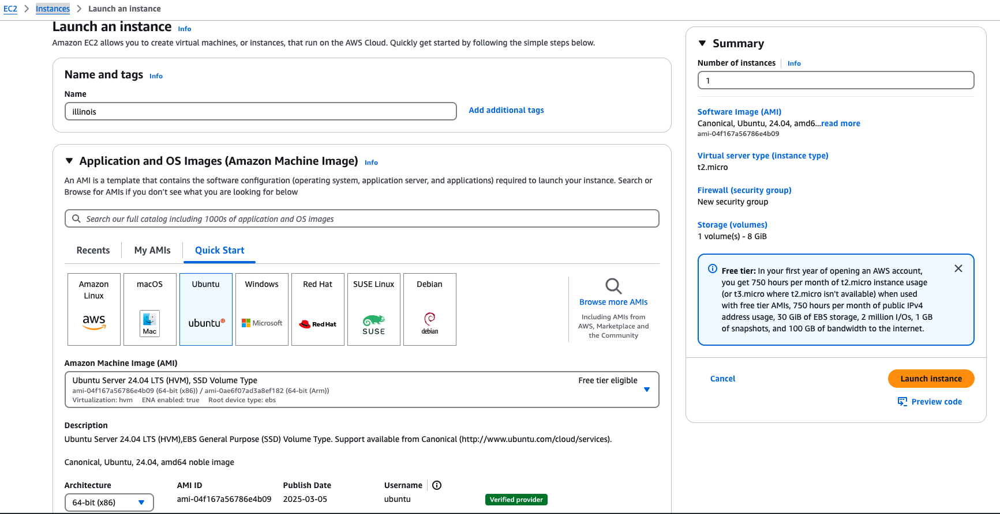
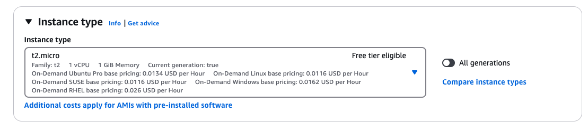
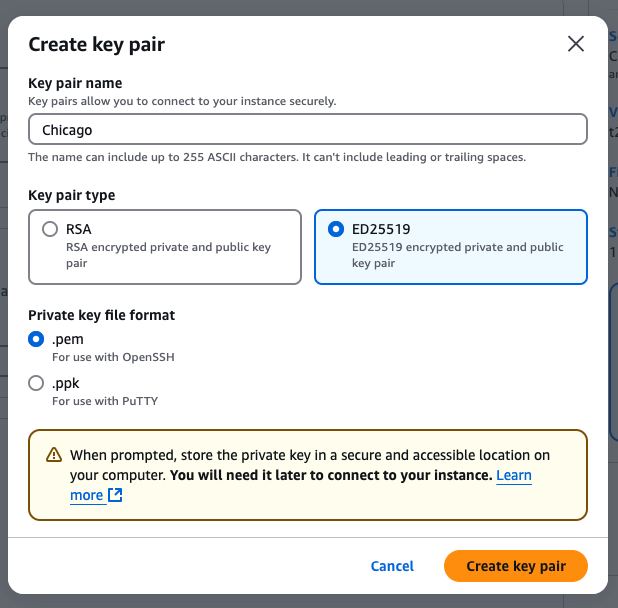
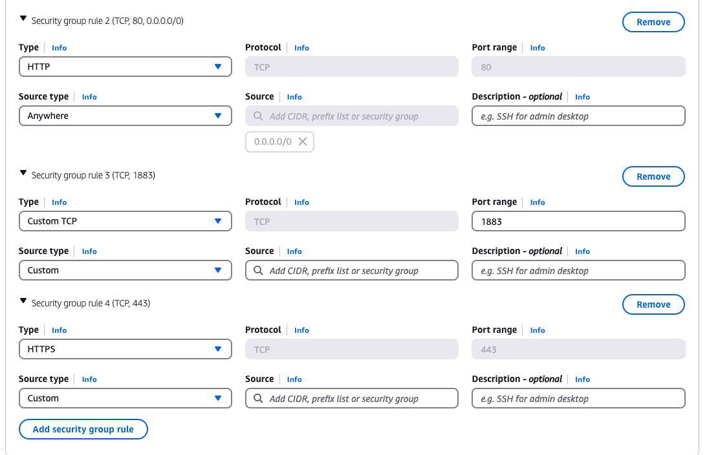

## This is how I like to setup my AWS EC2 instance

This is where I deploy my website and some useful backend stuff. It is by no means optimized for security or performance, but its a great middle ground.

1. Access the AWS EC2 Console

- Navigate to: [EC2 Console](https://us-east-2.console.aws.amazon.com/ec2/home)

## 2. Configure Instance Settings

### Basic Configuration

- **Name**: Choose a good one, but it does not matter what it is
- **Application and OS Images**: Ubuntu (best supported, most open source operating system)
- **Amazon Machine Image**: Whichever is free
- **Architecture**: 64-bit (x86)
- **Instance Type**: Whichever is free tier eligible is fine for anyone to start with, I personally use a t3.small

## 3. Key Pair Setup

- **Name**: Good trick is to use something associated with your server name (e.g. illinois, chicago)
- **Type**: ED25519 (faster, stronger encryption than RSA)
- **Format**: .pem

> **Note**: The .pem file will download automatically. Store it somewhere safe! If you are not well versed in navigating file systems, the safest spot is probably an "important" folder on your desktop.

## 4. Security Group Configuration

The default security group only opens SSH ports. Here are some that I open because I use them:

- **HTTP (Unencrypted)**

  - Type: HTTP
  - Port Range: 80
  - Source: Anywhere

- **HTTPS (Encrypted)**

  - Type: HTTPS
  - Port Range: 443
  - Source: Anywhere

- **Unencrypted MQTT**

  - Type: Custom TCP
  - Port Range: 1883
  - Source: Anywhere

- **Encrypted MQTT**
  - Type: Custom TCP
  - Port Range: 8883
  - Source: Anywhere

## 5. Storage Configuration

8 GiB is fine for now- if you run out it's [easy to expand](ryanjoyce.me).

## 6. Launch Instance

You're good to go! You now have a computer running in the cloud and are by default super sick. Best ways to access are with

- EC2 Instance Connect (browser-based in the AWS console)
- SSH using your .pem key (recommended)

> **Pro Tip**: For super easy direct computer access, set up your .pem key following [this guide](ryanjoyce.me).
